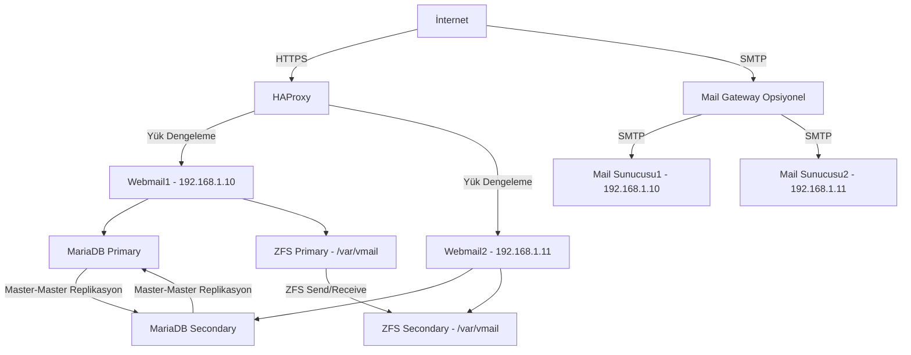
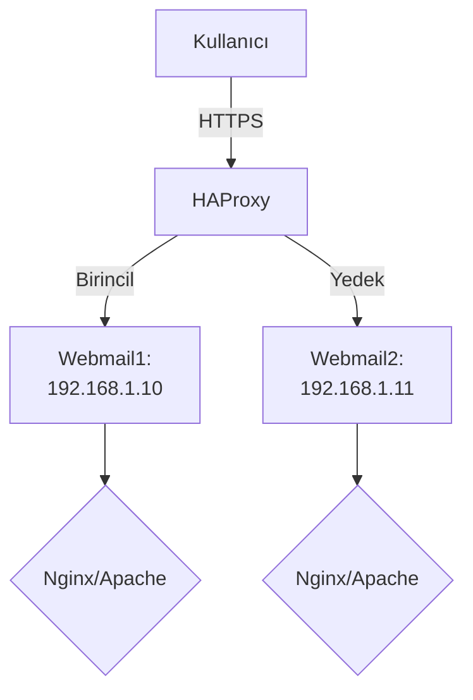
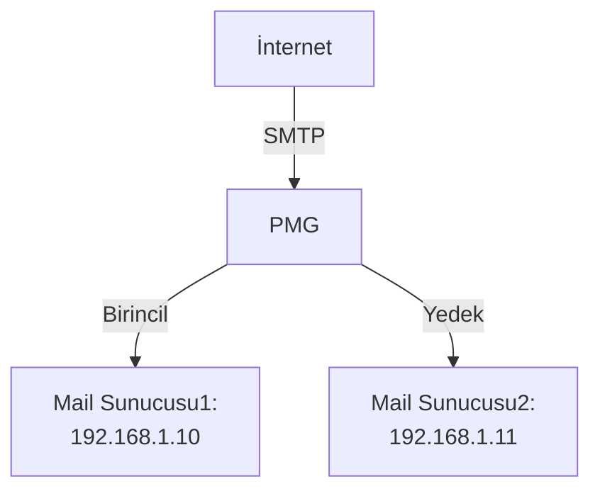
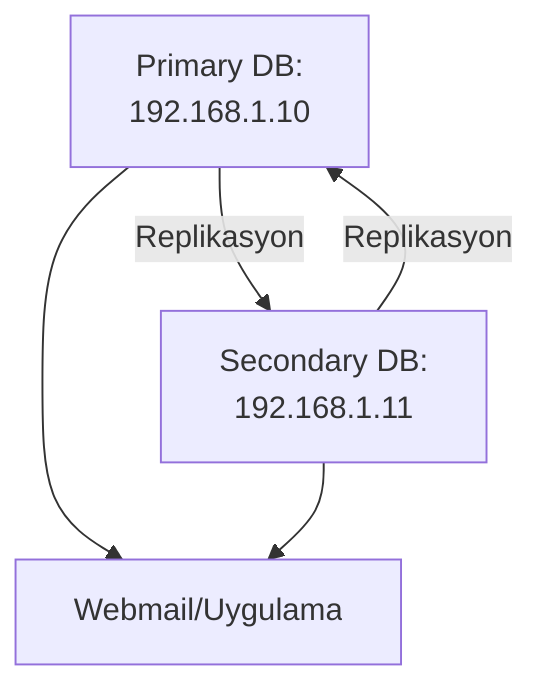
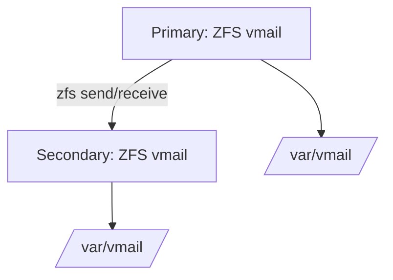

# 📧 Mail Cluster Mimarisi

Bu projede, yüksek erişilebilirlik ve veri bütünlüğü sağlayan bir mail cluster sistemi tasarlanmıştır. Sistem, aşağıdaki bileşenlerden oluşmaktadır:

## 🗺️ Genel Topoloji Diyagramı

Aşağıdaki diyagram, mail cluster mimarisinin tüm bileşenlerini özetler:



## 🔁 Yük Dengeleme (Web Arayüzü)

Web tabanlı erişim (ör. webmail veya yönetim panelleri), **HAProxy** ile yük dengelemesi yapılarak iki sunucu arasında dağıtılmıştır.  
Bu sayede:
- Yüksek erişilebilirlik sağlanmıştır.
- Trafiğin dengeli dağılımı garanti altına alınmıştır.

## 🗄️ Veritabanı (DB) Mimarisi

**MariaDB** kullanılarak **Master-Master replikasyon** yapısı kurulmuştur.  
Avantajları:
- Her iki sunucuda da yazılabilir veritabanı.
- Sunucu arızasında veri kaybı olmadan devamlılık.

## 📁 ZFS ile Mail Verisi Senkronizasyonu

Mail verileri ve yapılandırma dosyalarının senkronizasyonu için **ZFS dosya sistemi** kullanılmıştır.  
Bu sistem ile:
- Gerçek zamanlı eşitleme sağlanmıştır.
- Dosya tutarlılığı ve yedeklilik elde edilmiştir.

## 🔧 HAProxy Yapılandırması



Web arayüzünün yüksek erişilebilirliğini sağlamak için HAProxy yapılandırması yapılmıştır.  
Birincil (Primary) sunucuda **Nginx** veya **Apache** servislerinde sorun oluştuğunda, istekler otomatik olarak ikincil (Secondary) sunucuya yönlendirilerek kesintisiz **Webmail** hizmeti sağlanır.

Aşağıda örnek bir HAProxy konfigürasyonu verilmiştir:

```haproxy
frontend webmail_https
    bind *:443 ssl crt /etc/haproxy/certs/test.com.pem
    mode http
    default_backend webmail_back

backend webmail_back
    mode http
    option httpchk GET /
    default-server inter 3s fall 3 rise 2

    server webmail1 192.168.1.10:443 ssl verify none check
    server webmail2 192.168.1.11:443 ssl verify none check backup
```

### 🧩 Yapılandırmaya Ait Açıklamalar:

- `frontend webmail_https`: Gelen HTTPS bağlantılarını karşılayan ön uç (frontend) tanımıdır.
- `bind *:443 ssl crt /etc/haproxy/certs/test.com.pem`: 443 numaralı port üzerinden SSL sertifikası ile bağlantı kabul edilir.
- `mode http`: HAProxy'nin HTTP modunda çalışmasını sağlar.
- `default_backend webmail_back`: Tüm HTTPS trafiği `webmail_back` adlı arka uca yönlendirilir.

- `backend webmail_back`: Webmail için yönlendirme yapılacak sunucular bu kısımda tanımlanır.
- `option httpchk GET /`: HAProxy, belirli aralıklarla `/` yoluna GET isteği atarak sunucunun çalışıp çalışmadığını kontrol eder.
- `default-server inter 3s fall 3 rise 2`:
  - `inter 3s`: Her 3 saniyede bir sağlık kontrolü yapılır.
  - `fall 3`: Bir sunucu 3 ardışık başarısız yanıt verirse "çalışmıyor" kabul edilir.
  - `rise 2`: 2 ardışık başarılı yanıt sonrasında sunucu tekrar "çalışır" olarak işaretlenir.

- `server webmail1 192.168.1.10:443 ssl verify none check`:  
  Birincil (aktif) webmail sunucusunun IP adresidir.
- `server webmail2 192.168.1.11:443 ssl verify none check backup`:  
  İkincil (yedek) webmail sunucusudur. `backup` etiketi, yalnızca birincil sunucu erişilemez olduğunda devreye girmesini sağlar.

> 🔄 **Not**: IP adresleri örnek olarak verilmiştir. Kendi altyapınıza göre güncelleyin.

## 📬 Mail Gateway Yapılandırması (Opsiyonel)



**Mail Gateway** kullanımı, güvenlik ve kararlılık açısından önerilir.  
Bu, saldırganların mail sunucusuna zararlı dosyalar veya oltalama (phishing) mailleri göndermesini engeller.  
Mail Gateway yapılandırması **opsiyoneldir**. Aşağıdaki **MX kayıtları** ile bu yapıyı kurabilirsiniz:

```dns
@ IN MX 10 mail.test.com
@ IN MX 20 backupmail.test.com
```

> 📌 DNS kaydındaki öncelik değerine göre mail iletimi sağlanır.  
> Örneğin, birincil sunucuda sorun yaşanırsa, mailler ikinci öncelikli sunucuya yönlendirilir.

**Proxmox Mail Gateway (PMG)** kullanılmıştır.  
Aşağıdaki yapılandırma, **Postfix** tabanlı sistemler için uygundur.  
Farklı bir **SMTP** sunucusu kullanıyorsanız, yapılandırmayı uyarlayın.

```postfix
relay_transport = smtp:192.168.1.10:25
smtp_fallback_relay = [192.168.1.11]:25
soft_bounce = yes
bounce_queue_lifetime = 1h
```

### ⚙️ Açıklamalar:

- `relay_transport = smtp:192.168.1.10:25`: Gelen maillerin ilk olarak bu SMTP sunucusuna yönlendirilmesini sağlar.
- `smtp_fallback_relay = [192.168.1.11]:25`: Birincil sunucu çalışmazsa, mailler yedek sunucuya yönlendirilir.
- `soft_bounce = yes`: Geçici teslim hatalarında mesajın reddedilmesini engeller.
- `bounce_queue_lifetime = 1h`: Teslim edilemeyen maillerin kuyrukta tutulma süresi (1 saat).

> 🔄 Bu yapılandırma, gateway üzerinden yedeklilik ve güvenli bir mail sistemi sağlar.

## 🛠️ MariaDB Master-Master Replikasyon




**MariaDB** veritabanı ile **Master-Master replikasyon** yöntemi kullanılmıştır.  

### 🔹 1. Adım: Primary Sunucuda Yapılacaklar

**Primary** sunucuya bağlanın ve MySQL oturumunu başlatın:

```sql
CREATE USER 'replicator'@'%' IDENTIFIED BY '12345678';
GRANT REPLICATION SLAVE ON *.* TO 'replicator'@'%';
SHOW MASTER STATUS;
```

> ⚠️ **Güvenlik Notu**: Gerçek sisteminizde `12345678` yerine güçlü bir parola kullanmalısınız (ör. en az 16 karakter, harf, rakam ve özel karakter içeren).

> ⚠️ **MySQL Port**: 3306 portunu kullanmış olduğunuz FW yazılımına göre dış dünyaya veya sadece replikasyon yapacağınız sunucuya açmayı unutmayınız.


Örnek çıktı:

```text
+--------------------+----------+----------------------------------------------+-------------------------------+
| File               | Position | Binlog_Do_DB                                 | Binlog_Ignore_DB              |
+--------------------+----------+----------------------------------------------+-------------------------------+
| mariadb-bin.000001 |      245 | amavisd,iredadmin,iredapd,roundcubemail,sogo | test,information_schema,mysql |
+--------------------+----------+----------------------------------------------+-------------------------------+
```

> ℹ️ `File` ve `Position` alanları, replikasyonun senkronizasyon noktasını gösterir. Bu değerleri **Secondary** sunucuda kullanacağız.

### 🔹 2. Adım: Secondary Sunucuda Yapılacaklar

**Secondary** sunucuya bağlanın ve aşağıdaki komutları çalıştırın:

```sql
CREATE USER 'replicator'@'%' IDENTIFIED BY '12345678';
GRANT REPLICATION SLAVE ON *.* TO 'replicator'@'%';

STOP SLAVE;
CHANGE MASTER TO 
    MASTER_HOST='192.168.1.10',
    MASTER_USER='replicator',
    MASTER_PASSWORD='12345678',
    MASTER_LOG_FILE='mariadb-bin.000001',
    MASTER_LOG_POS=245;

START SLAVE;
SHOW MASTER STATUS;
SHOW SLAVE STATUS\G;
```

> 📌 `MASTER_LOG_FILE` ve `MASTER_LOG_POS` değerlerini **Primary** sunucudaki çıktıya göre doldurun.

MariaDB servisini yeniden başlatın:

```bash
systemctl restart mariadb
```

### 🔹 3. Adım: Primary Sunucuyu Secondary’ye Bağlamak

**Primary** sunucuya dönüp replikasyonu ters yönde yapılandırın:

```sql
STOP SLAVE;
CHANGE MASTER TO 
    MASTER_HOST='192.168.1.11',
    MASTER_USER='replicator',
    MASTER_PASSWORD='12345678',
    MASTER_LOG_FILE='mariadb-bin.000001',
    MASTER_LOG_POS=289;

START SLAVE;
SHOW SLAVE STATUS\G;
```

> 📌 `MASTER_LOG_POS` değeri **Secondary** sunucunun `SHOW MASTER STATUS` çıktısına göre ayarlanmalıdır.

MariaDB servisini yeniden başlatın:

```bash
systemctl restart mariadb
```

### ✅ Test Etme

**RoundcubeMail** arayüzü ile bir posta sunucusuna giriş yaparak test edin.  
`roundcubemail -> users` tablosunu her iki sunucuda kontrol edin.  
Değişiklikler senkronize olduysa yapılandırma başarılıdır.

> 🔁 **Not**: Kullanıcı ekleme veya değiştirme işlemleri yalnızca **Primary** sunucuda yapılmalıdır.


## 📁 ZFS ile Mail Verisi Senkronizasyonu



ZFS dosya sistemi, **Primary** sunucudan **Secondary** sunucuya snapshotlar aracılığıyla tek taraflı senkronizasyon sağlar.  
ZFS `send` ve `receive` komutları kullanılarak snapshotlar belirli aralıklarla **Primary** sunucudan **Secondary** sunucuya aktarılır.  
Çift taraflı senkronizasyon, veri döngülerine ve gereksiz bellek yüküne neden olabileceğinden önerilmez.

### ZFS Kurulumu

ZFS’yi kurun:

```bash
sudo apt install zfsutils-linux
```

ZFS için ayrı bir disk gereklidir. VPS sağlayıcınızdan ek bir boş disk talep edebilirsiniz.

Ek diski iki partisyona bölün. Ayrıntılı adımlar için:  
[Ubuntu Türkiye: Fdisk ile Disk Yönetimi](https://wiki.ubuntu-tr.net/index.php?title=Fdisk_ile_disk_yönetimi)

### ZFS Pool Oluşturma

ZFS havuzu oluşturun:

```bash
sudo zpool create vmail /dev/sdb1 /dev/sdb2
```

> **Not**: Bu işlemi **Secondary** sunucuda da tekrarlayın.

Havuz yapısını ve disklerin eşlendiğini doğrulayın:

```bash
sudo zpool status
```

### Snapshot Oluşturma ve Aktarma

**Primary** sunucuda snapshot oluşturun:

```bash
sudo zfs snapshot vmail@snapshot1
```

Snapshot’ı **Secondary** sunucuya aktarın:

```bash
sudo zfs send vmail@snapshot1 | sshpass -p 'yourpassword' ssh root@192.168.1.11 "sudo zfs receive vmail"
```

Snapshot’ın başarıyla oluşturulduğunu kontrol edin:

```bash
sudo zfs list -t snapshot
```

Eğer snapshot görünmüyorsa, `zfs send` komutunu tekrar çalıştırın.  
Sorun devam ederse, `-F` parametresiyle verileri sıfırlayıp tekrar aktarabilirsiniz:

```bash
sudo zfs send vmail@snapshot1 | sshpass -p 'yourpassword' ssh root@192.168.1.11 "sudo zfs receive -F vmail"
```

### ZFS Mountpoint Ayarı

ZFS dosya sistemini `/var/vmail` dizinine bağlayın:

```bash
sudo zfs set mountpoint=/var/vmail vmail
```

Doğru monte edildiğini kontrol edin:

```bash
sudo zfs get mountpoint vmail
```

### Önemli Notlar

- ZFS işlemlerini her iki sunucuda da yapın.
- Yalnızca **Primary** sunucudan **Secondary** sunucuya senkronizasyon yapın.
- Eğer **Primary** sunucu çökerse, **Secondary** sunucudaki veriler snapshot alınarak **Primary** sunucuya geri gönderilebilir.

### Otomasyon Scripti

Repoda bulunan script, her gün belirli bir saatte snapshot alarak **Secondary** sunucuya gönderir. Scripti crontab’a ekleyin veya özelleştirin:

```bash
0 2 * * * /path/to/zfs-sync.sh
```


## Teşekkürler

Bu projeyi hayata geçirirken edindiğim bilgi ve tecrübeler, sistem mimarisi ve dağıtık yapıların gücünü daha yakından anlamamı sağladı. Her bir bileşeni detaylı bir şekilde planlamak, uygulamak ve test etmek, hem teknik becerilerimi hem de problem çözme yetkinliğimi geliştirdi.

Bu süreçte bana doğrudan veya dolaylı katkı sunan herkese teşekkür ederim. Ayrıca, açık kaynak toplulukları ve ilgili teknik dökümantasyonların sağladığı kaynaklar sayesinde bu mimari daha sağlam temeller üzerine oturtuldu. Paylaşımın gücüne inanıyor ve bu çalışmanın başkalarına da ilham olmasını umuyorum.

